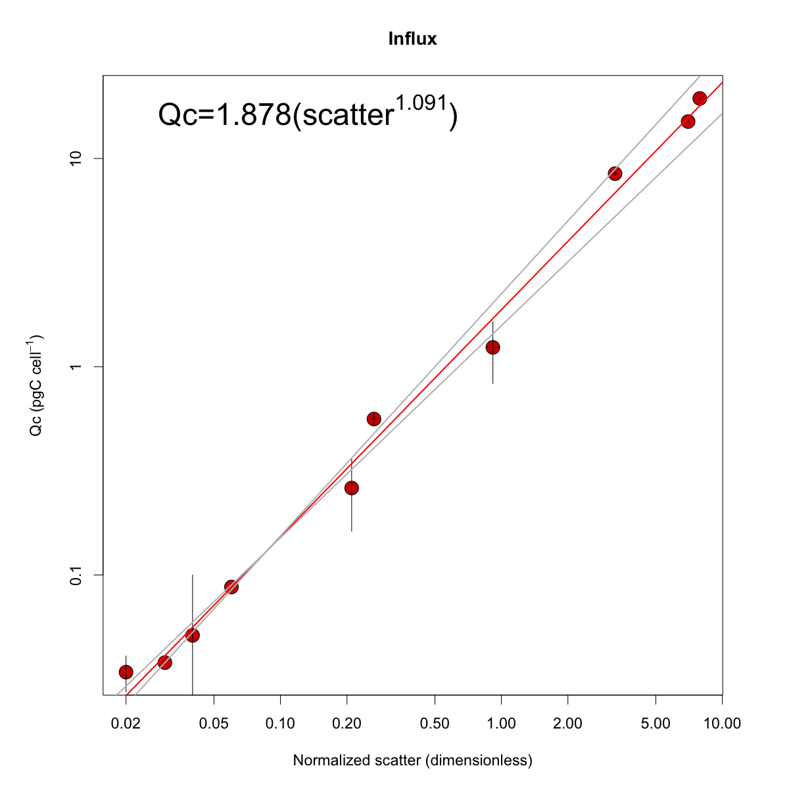

# Calibration light scattering - carbon per cell
The goal of the experiment was to calibrate light scattering measured by our BD Influx cell sorter and two SeaFlow instruments into cellular carbon content using phytoplankton cultures of various shapes and sizes.

We used cultures grown under continuous light and monitored the cultures daily to ensure cells were growing exponentially at the start of the experiment. Below is the list of the species used:
- MED4: *Prochlorococcus* HLI
- 1314: *Prochlorococcus* HLII
- AS9601: *Prochlorococcus* HLII
- NAT12A: *Prochlorococcus* LLI
- 7803: *Synechcoccus*
- WH8102: *Synechcoccus*
- MICRO: *Micromonas pusilla*
- NAV: *Navicula transitans*
- TAPS1135: *Thalassiosira pseudonana*
- TAPS3367: *Thalassiosira pseudonana*

See [notebook.pdf](https://github.com/armbrustlab/fsc-poc-calibration/blob/master/notebook.pdf) for more details.

We measured cell abundance using BD Influx cell sorter (see [influx-cultures.csv](https://github.com/armbrustlab/fsc-poc-calibration/blob/master/influx-cultures.csv)) and total particulate organic carbon in triplicate using CHN analyzer (see [poc-data.csv](https://github.com/armbrustlab/fsc-poc-calibration/blob/master/poc-data.csv)). Estimates of carbon cell quotas for each culture were calculated by normalizing POC by cell number, data file is available here: [Qc-cultures.csv](https://github.com/armbrustlab/fsc-poc-calibration/blob/master/Qc-cultures.csv).

The entire analysis used to generate carbon cell quotas is available in [analysis_influx.R](https://github.com/armbrustlab/fsc-poc-calibration/blob/master/analysis_influx.R). Raw CHN data are available in [UW_Exp_PCPN_DATA_FR.xlsx](https://github.com/armbrustlab/fsc-poc-calibration/blob/master/UW_Exp_PCPN_DATA_FR.xlsx); raw FCM files (3.8 GB) can be downloaded using [Dat](https://github.com/datproject/dat). After installation, simply type in the terminal to start download data ```dat clone dat://cdfef982ea4032592e454c1a39b0a3855738b309d7e78ef8b2d0152adc5ffd02```

The light scattering property of each cell (alive, not fixed), normalized by 1 micron beads, was then measured by our BD Influx cell sorter and two SeaFlow instruments (#751 and #740). A linear regression model (type II) was then used to fit normalized forward light scatter to carbon content per cell. The plot below shows the BD influx calibration curve.



We still have a few extra FCM samples that we will be happy to share. Contact us if you are interested (ribalet@uw.edu)

***François Ribalet, Angelicque White, Katie Watkins-Brandt, Rhonda Morales, Megan Schatz & Virginia Armbrust contributed to this project.***
