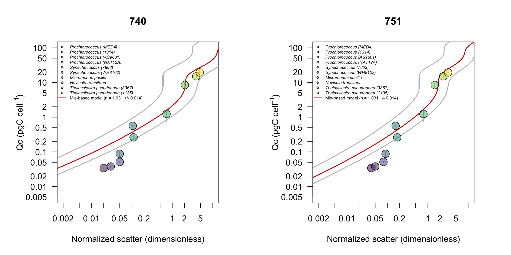

# Calibration light scattering - carbon per cell
A set of experiments was conducted to compare measurements of carbon quotas with those estimated from [Mie predicted cell diameter](https://github.com/armbrustlab/fsc-size-calibration). Carbon per cell was determined for 6 axenic cyanobacteria cultures (<i>Prochlorocococcus</i> MED4, MIT9312, AS9601 and NATL12A, <i>Synechococcus</i> WH7803 and WH8012) and 4 different eukaryotic phytoplankton cultures (<i>Micromonas pusilla, Navicula transitans, Thalassosira pseudonana</i> 3367 and 1135). Particulate C and N collected on pre-combusted 0.3-µm GF-75 or 0.7-µm GF/F filters were analyzed on a Carlo Erba CHNS analyzer (model NA1500) in the Oregon State University Stable Isotope Laboratory using cystine (29.99% C and 11.66% N by weight) as the primary standard. For each culture, aliquots of growth media were filtered through three pre-combusted GF-75 and GF/F glass fiber filters used as blanks to correct for background carbon concentration on filters before filtration and DOC adsorption onto filters. Carbon quotas were obtained by normalizing the concentrations of blank-corrected particulate carbon to cell abundance measured with a BD Influx cell sorter. Mie-predicted cell diameter based on light scatter measurements from SeaFlow was converted to carbon quotas using the equation <i>fgC cell<sup>-1</sup></i> = 0.216 x <i>Volume}</i><sup>-0.939</sup> (Menden-Deuer 2000), assuming spherical particle. We found that carbon quotas were in good agreement with our light scatter-based estimates using an index of refraction of 1.38, consistent with our cell [diameter results](https://github.com/armbrustlab/fsc-size-calibration).


Cultures were grown under continuous light and monitored the cultures daily to ensure cells were growing exponentially at the start of the experiment. See [notebook.pdf](https://github.com/armbrustlab/fsc-poc-calibration/blob/master/notebook.pdf) for more details.
We measured cell abundance using BD Influx cell sorter (see [influx-cultures.csv](https://github.com/armbrustlab/fsc-poc-calibration/blob/master/influx-cultures.csv)) and total particulate organic carbon in triplicate using CHN analyzer (see [poc-data.csv](https://github.com/armbrustlab/fsc-poc-calibration/blob/master/poc-data.csv)). Estimates of carbon cell quotas for each culture were calculated by normalizing POC by cell number, data file is available here: [Qc-cultures.csv](https://github.com/armbrustlab/fsc-poc-calibration/blob/master/Qc-cultures.csv).
The entire analysis used to generate carbon cell quotas is available in [analysis_influx.R](https://github.com/armbrustlab/fsc-poc-calibration/blob/master/analysis_influx.R). Raw CHN data are available in [UW_Exp_PCPN_DATA_FR.xlsx](https://github.com/armbrustlab/fsc-poc-calibration/blob/master/UW_Exp_PCPN_DATA_FR.xlsx); raw FCM files (3.8 GB) can be downloaded using [Dat](https://github.com/datproject/dat). After installation, simply type in the terminal to start download data ```dat clone dat://cdfef982ea4032592e454c1a39b0a3855738b309d7e78ef8b2d0152adc5ffd02```

We still have a few extra FCM samples that we will be happy to share. Contact us if you are interested (ribalet@uw.edu)

***François Ribalet, Jarred Swalwell, Katie Watkins-Brandt, Rhonda Morales, Megan Schatz & Angelicque White contributed to this project.***
